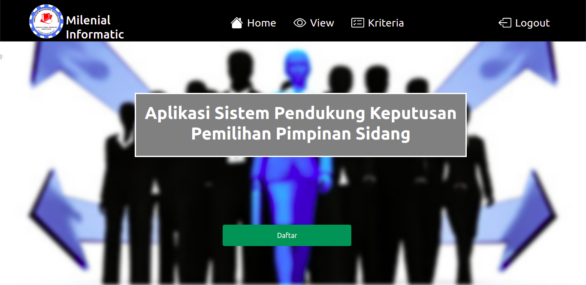
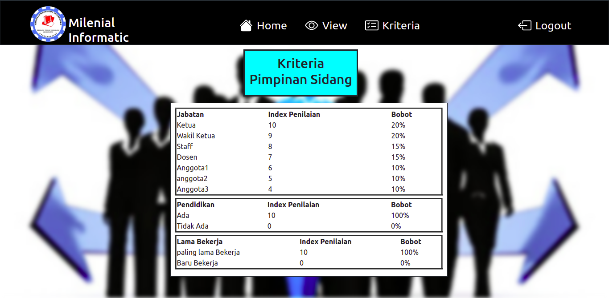
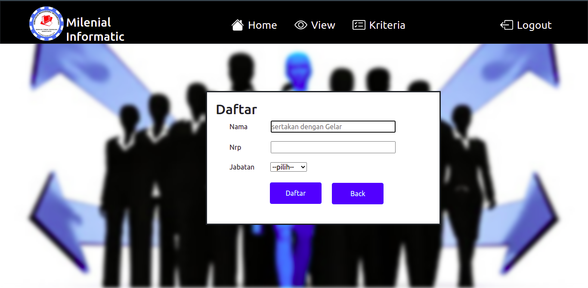

# Tentang Aplikasi
Aplikasi Sistem Pendukung Keputusan Pemilihan pimpinan sidang adalah salah satu aplikasi spk berbasi website yang bertujuan untuk menentukan seorang
pimpinan sidang berdasarkan tiga kriteria utama yakni `Pendidikan`. , `Lama Bekerja `. dan `Jabatan`.

# Fitur Aplikasi
<ul>
<li>Kelola Daftar Calon Pimpinan Sidang</li>
<li>Sistem Penentuan Pimpinan Sidang</li>
</ul>

# Teknologi Yang digunakan
<ul>
<li>Boostrap V4</li>
<li>PHP Native</li>
</ul>

# Hak Akses 
<ul>
<li> Admin</li>

</ul>

# Instalasi
Untuk mengunduh aplikasi silahkan clone menggunakan git dengan perintah dibawah
```
git clone https://github.com/Nofrisdan/Plugin-Keranjang-Belanja.git
```

:warning: **Silahkan Menghubungi Saya jika mengalami masalah dalam proses instalasi dan jalannya aplikasi**:


# Gambar Aplikasi 







